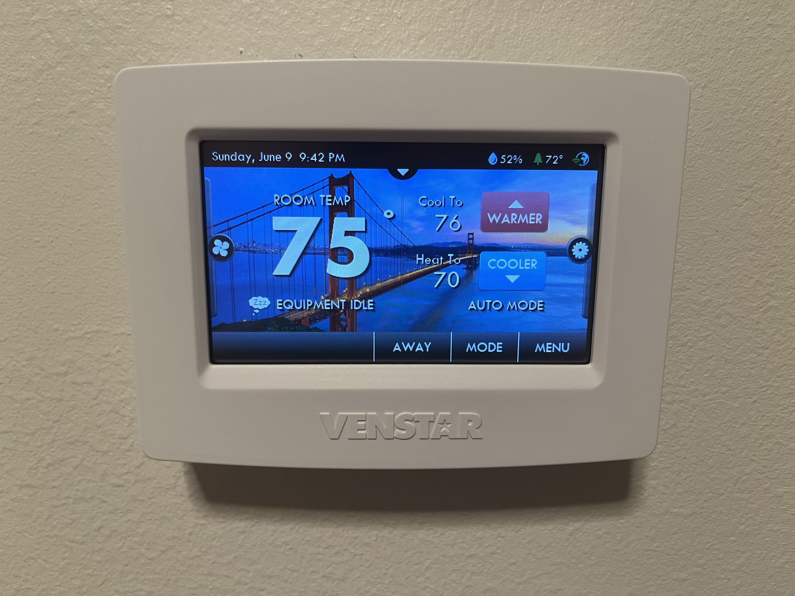
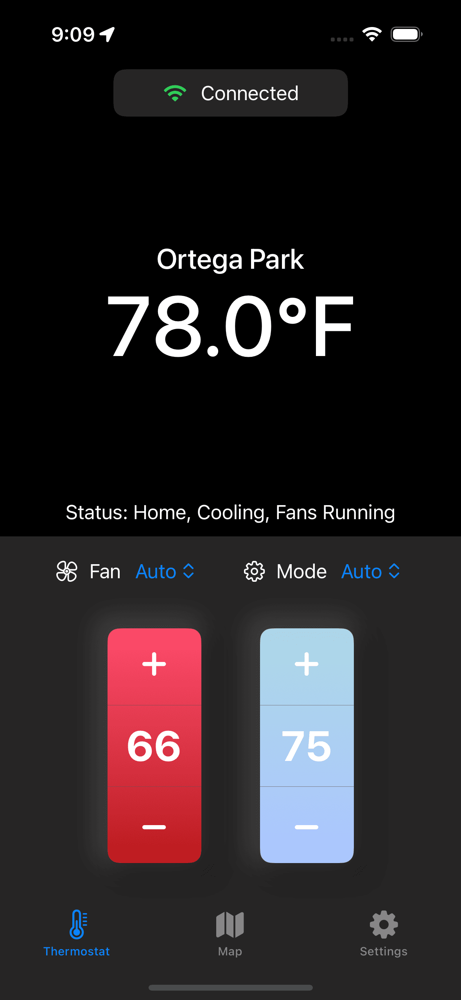
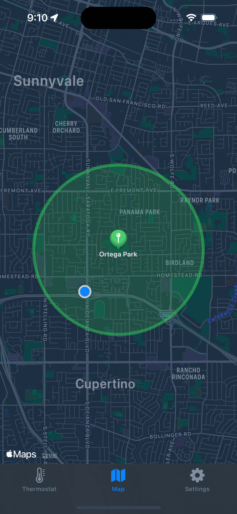
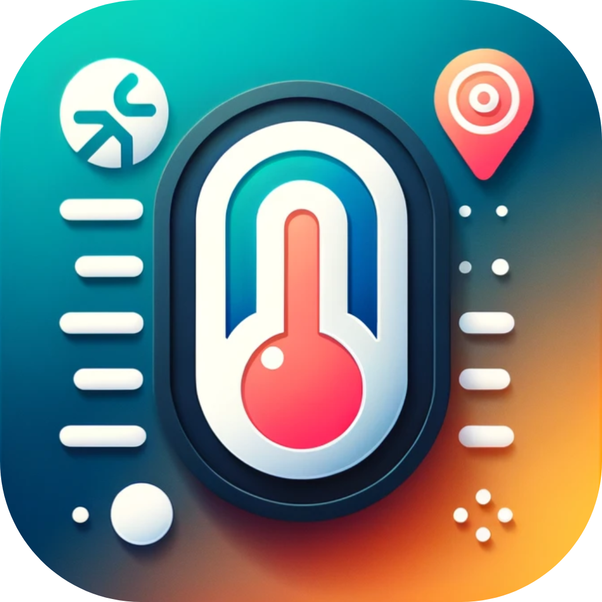
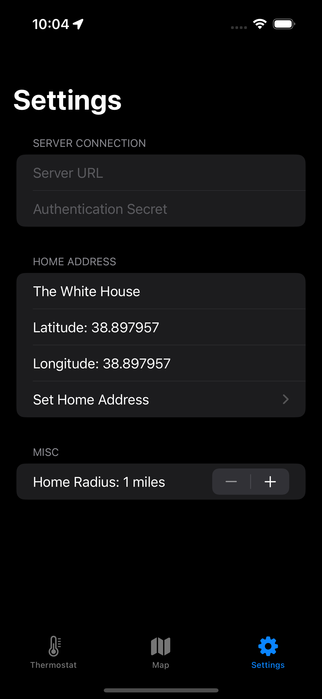
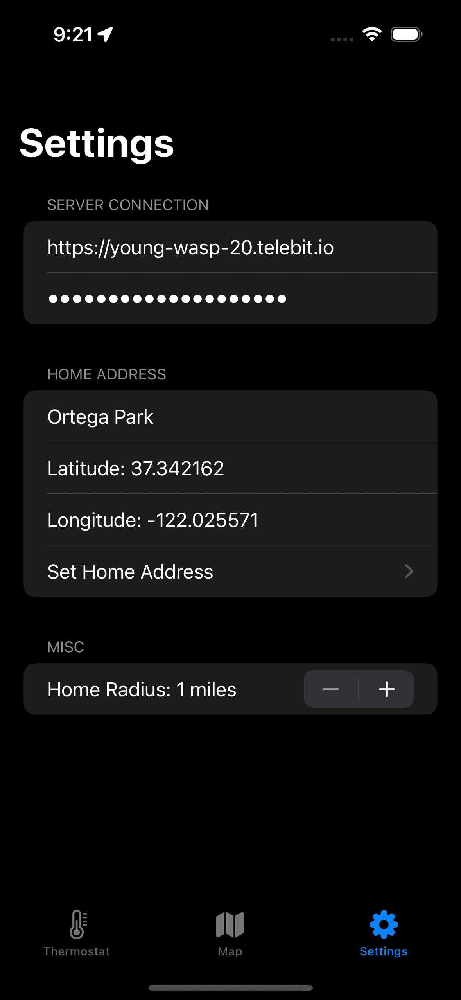
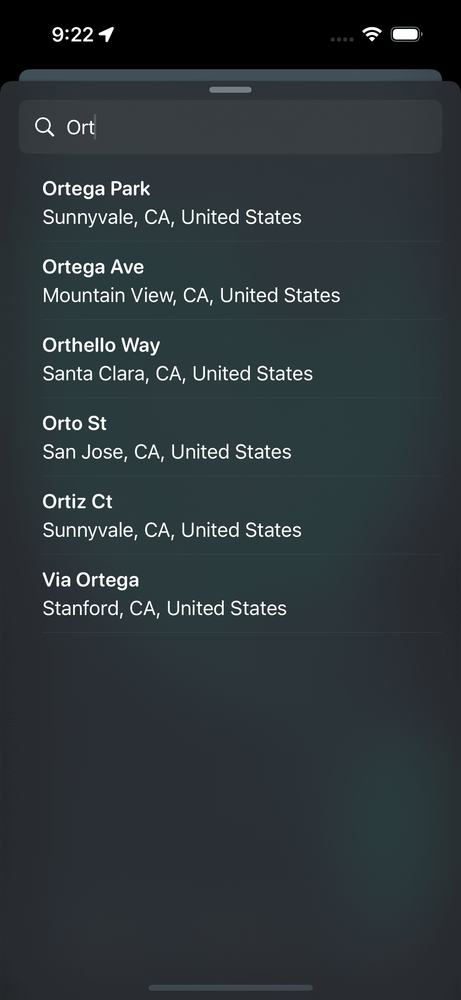
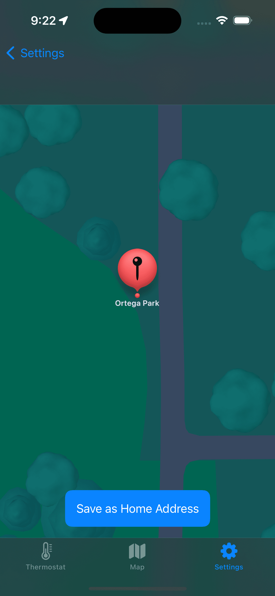
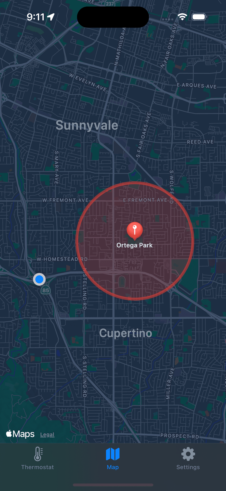

# Location Based Thermostat Control for iOS


## Concept Overview

This project is an iOS app (and server) to help you save on your energy bill. By using your location, the app adjusts your thermostat's heating & cooling while you are away!


<table>
  <tr>
    <td></td>
    <td></td>
    <td><td></td></td>
    <td><td></td></td>
  </tr>
</table>
    
## Technology Overview

iOS:

- Swift
- Combine - Reactive programming framework for implementing the Observer pattern, much like ReactiveX
- Security / Keychain - Securely storing the password on the device
- Alamofire - HTTP networking library for handling requests to the server
- CoreLocation - Framework for location tracking 
- MapKit - Apple Maps provider for displaying the users location
- SwiftUI - Declarative framework for UI

Server:

- Python
- FastAPI - Exposing thermostat functionality to the internet via a REST API

## Server Setup

```
git clone https://github.com/jackw2/thermostat-control-app.git
pip install venstarcolortouch
pip install fastapi
```

To enable your thermostat to communicate with the server, you will need to edit change the settings. Enable wifi access at `Settings > Wifi > Local API. Verify you can access the thermostat via it's ip address:

```
curl $thermostat_ip_address
{"api_ver":9,"type":"residential","model":"COLORTOUCH","firmware":"6.93"}
```

You should see a response like the one above.

Configure `config.json`, then start the sever:

```
fastapi dev main.py
```

Set up [telebit.cloud](https://telebit.cloud/) to make your server availible to the internet (you can use a static ip or whatever methond you prefer).

```
curl https://get.telebit.io/ | bash
~/telebit http 8000
```

Et Voila! You can confirm the server is running by visiting the root endpoint, or by using the iOS App. 

## iOS Setup

Set the temperature, fan settings, and mode here. You can monitor the temperature and the status of your thermostat.


Connect to the server, rename your home, and set the radius where you want the thermostat to begin heating/cooling.
<table>
  <tr>
    <td></td>
    <td></td>
  </tr>
</table>

Search for the address you want to mark as your home.

<table>
  <tr>
    <td></td>
    <td></td>
  </tr>
</table>

Now as you approach your home, the thermostat will automatically turn on, and disable as you leave, reducing wasted energy temperature-controlling your home, even in the background.

<table>
  <tr>
    <td></td>
    <td></td>
  </tr>
</table>

## Compatibility

Designed to be compatible with any of the Venstar Colortouch series. Tested with the T7900 Residential Thermostat.
